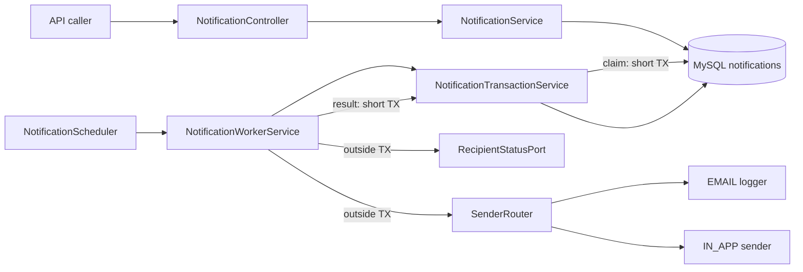
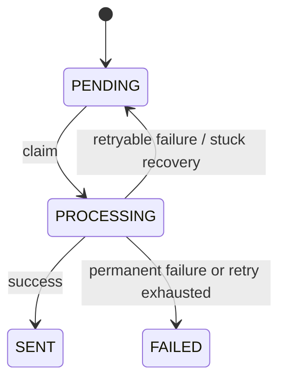
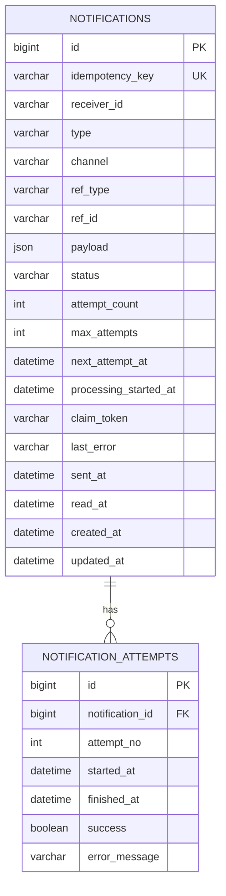

# 알림 발송 시스템

## 프로젝트 개요

과제 C의 비동기 알림 발송 시스템입니다. API는 알림 요청을 DB에 `PENDING`으로 저장하고
즉시 응답하며, 별도 worker가 EMAIL 또는 IN_APP 발송을 처리합니다. 중복 요청, 자동
재시도, 서버 재시작, stuck worker, 다중 인스턴스 동시 처리를 실제 MySQL에서 검증합니다.

## 기술 스택

- Java 21, Spring Boot 4.0.7
- Spring MVC, Spring Data JPA, Querydsl 5.1
- MySQL 8, Flyway
- JUnit 5, Testcontainers, Awaitility
- Gradle, Docker Compose

## 실행 방법

### Docker Compose

Docker만 설치되어 있으면 애플리케이션과 MySQL을 함께 실행할 수 있습니다.

```bash
docker compose up --build
```

기동 확인:

```bash
curl http://localhost:8080/actuator/health
```

```json
{"status":"UP"}
```

종료:

```bash
docker compose down
```

이전에 `schema.sql` 방식으로 생성한 개발 볼륨처럼 Flyway 이력이 없는 DB가 남아 있다면
한 번만 볼륨을 초기화해야 합니다. 과제 제출 환경은 fresh DB를 기준으로 합니다.

```bash
docker compose down -v
docker compose up --build
```

### 로컬 실행

Java 21과 Docker가 필요합니다.

```bash
docker compose up -d mysql
./gradlew bootRun
```

Windows에서는 `./gradlew` 대신 `gradlew.bat`을 사용할 수 있습니다.

## API 목록 및 예시

### 알림 등록

```http
POST /api/notifications
```

```bash
curl -i -X POST http://localhost:8080/api/notifications \
  -H "Content-Type: application/json" \
  -H "Idempotency-Key: payment-2026-001-user-1-email" \
  -d '{
    "receiverId": "user-1",
    "type": "PAYMENT_CONFIRMED",
    "channel": "EMAIL",
    "refType": "PAYMENT",
    "refId": "payment-2026-001",
    "payload": {"courseTitle": "Spring Boot 입문"}
  }'
```

신규 요청과 중복 요청 모두 `202 Accepted`입니다. 중복 요청은 기존 ID와
`duplicated: true`를 반환합니다.

```json
{
  "notificationId": 1,
  "status": "PENDING",
  "duplicated": false
}
```

`Idempotency-Key`를 생략하면 다음 필드 조합으로 키를 자동 생성합니다.

```text
type + refType + refId + receiverId + channel
```

같은 명시적 키를 다른 요청 본문에 재사용하면 `422 IDEMPOTENCY_KEY_MISUSE`를 반환합니다.

### 알림 상태 조회

```bash
curl http://localhost:8080/api/notifications/1
```

```json
{
  "id": 1,
  "receiverId": "user-1",
  "type": "PAYMENT_CONFIRMED",
  "channel": "EMAIL",
  "refType": "PAYMENT",
  "refId": "payment-2026-001",
  "status": "SENT",
  "attemptCount": 1,
  "maxAttempts": 3,
  "lastError": null,
  "sentAt": "2026-07-16T07:00:00Z",
  "readAt": null,
  "createdAt": "2026-07-16T06:59:59Z",
  "attempts": [
    {
      "attemptNo": 1,
      "success": true,
      "startedAt": "2026-07-16T07:00:00Z",
      "finishedAt": "2026-07-16T07:00:00Z",
      "errorMessage": null
    }
  ]
}
```

### 사용자 알림 목록

```bash
curl "http://localhost:8080/api/users/user-1/notifications?page=0&size=20"
```

최신순으로 반환하며 `size`는 1~100입니다.

```json
{
  "content": [
    {
      "id": 2,
      "receiverId": "user-1",
      "type": "COURSE_D1",
      "channel": "IN_APP",
      "refType": "COURSE",
      "refId": "course-1",
      "status": "SENT",
      "readAt": null,
      "createdAt": "2026-07-16T07:10:00Z"
    }
  ],
  "page": 0,
  "size": 20,
  "totalElements": 1,
  "totalPages": 1
}
```

읽음 필터는 IN_APP 알림에만 적용됩니다.

```bash
curl "http://localhost:8080/api/users/user-1/notifications?read=false"
curl "http://localhost:8080/api/users/user-1/notifications?read=true"
```

### 읽음 처리

```bash
curl -i -X PATCH http://localhost:8080/api/notifications/2/read
```

IN_APP 알림만 지원합니다. 여러 기기가 동시에 요청해도 최초 요청만 `read_at`을 기록하며
모든 요청은 `200 OK`를 받습니다. EMAIL 알림은 `400 CHANNEL_NOT_SUPPORTED`입니다.

### 오류 응답

```json
{
  "code": "NOTIFICATION_NOT_FOUND",
  "message": "알림을 찾을 수 없습니다: id=999"
}
```

주요 오류 코드는 다음과 같습니다.

| HTTP | 코드 | 의미 |
| --- | --- | --- |
| 400 | `INVALID_REQUEST` | 필수 필드, enum, payload 크기 또는 요청 형식 오류 |
| 400 | `CHANNEL_NOT_SUPPORTED` | EMAIL 알림 읽음 처리 요청 |
| 404 | `NOTIFICATION_NOT_FOUND` | 존재하지 않는 알림 |
| 422 | `IDEMPOTENCY_KEY_MISUSE` | 같은 명시적 키를 다른 본문에 재사용 |

## 비동기 처리 구조



처리는 세 경계로 분리됩니다.

1. 짧은 트랜잭션에서 `FOR UPDATE SKIP LOCKED`로 PENDING 행을 claim하고 PROCESSING으로 변경
2. DB 트랜잭션 없이 수신자 상태 확인과 외부 발송 수행
3. 별도 짧은 트랜잭션에서 상태 변경과 attempt 이력을 함께 기록

외부 I/O 동안 DB lock을 유지하지 않습니다. 실제 메시지 브로커로 전환할 때는 DB polling
진입점을 broker consumer로 교체하고 sender와 결과 기록 정책은 유지할 수 있습니다.

## 상태와 재시도 정책



- 최대 시도 횟수: 3회
- 기본 backoff: 30초, 2분, 10분
- 재시도 대기: 별도 상태 대신 `PENDING + next_attempt_at`
- 모든 시도: 성공 여부, 시작·종료 시각, 오류 메시지를 `notification_attempts`에 기록
- 예상하지 못한 예외: retryable `UNKNOWN` 실패로 기록
- PROCESSING이 기본 5분을 넘으면 stuck recovery가 PENDING으로 회수

worker가 회수 이후 늦게 결과를 반환할 수 있으므로 claim마다 UUID `claim_token`을 발급합니다.
결과 UPDATE는 `(id, PROCESSING, claim_token)`이 모두 일치할 때만 성공합니다. 오래된 worker의
결과는 상태와 attempt 이력을 변경하지 않습니다.

worker executor는 대기 큐를 두지 않고 빈 실행 슬롯만큼만 claim합니다. 실행 전 대기 시간이
stuck 시간으로 잘못 계산되는 것을 방지합니다.

## 실패 및 복구 데모

EMAIL mock sender는 receiver ID로 실패를 주입할 수 있습니다.

| receiverId 패턴 | 동작 |
| --- | --- |
| `fail-2-times-*` | 1·2회 일시 실패 후 3회 성공 |
| `fail-permanent-*` | 첫 시도에서 영구 실패 |
| `withdrawn-*` | 발송 없이 `RECIPIENT_GONE` 최종 실패 |
| `ghost-*` | 발송 없이 `RECIPIENT_NOT_FOUND` 최종 실패 |

재시도 성공 예시:

```bash
curl -X POST http://localhost:8080/api/notifications \
  -H "Content-Type: application/json" \
  -d '{
    "receiverId": "fail-2-times-demo",
    "type": "PAYMENT_CONFIRMED",
    "channel": "EMAIL",
    "refType": "PAYMENT",
    "refId": "retry-demo-1"
  }'

curl http://localhost:8080/api/notifications/1
```

기본 backoff가 적용되므로 최종 성공까지 약 2분 30초가 필요합니다. 테스트에서는 설정을
50ms로 덮어써 같은 흐름을 빠르고 결정적으로 검증합니다.

## 멱등성과 동시성

- 자동 키의 각 필드를 `문자열 길이:값`으로 인코딩해 필드에 `:`가 있어도 경계를 보존
- 명시적 키와 자동 키를 `explicit:`, `generated:` namespace로 분리
- 저장 키는 SHA-256 hex 64자로 고정
- 사전 조회로 일반적인 중복을 빠르게 처리
- `UNIQUE(idempotency_key)`로 동시 INSERT 경쟁을 최종 차단
- UNIQUE 경쟁에서 진 요청은 기존 행을 다시 조회해 같은 ID로 `202` 응답
- 읽음 처리는 `read_at IS NULL` 조건부 UPDATE로 동시 요청을 멱등 처리

## 데이터 모델 설명



주요 제약과 인덱스:

- `UNIQUE(idempotency_key)`
- `UNIQUE(notification_id, attempt_no)`
- `(status, next_attempt_at)` claim 인덱스
- `(receiver_id, created_at)` 목록 조회 인덱스

스키마는 [Flyway V1](src/main/resources/db/migration/V1__init_schema.sql)에서 관리하고 JPA는
`ddl-auto=validate`로 매핑 일치만 확인합니다.

## 설정

Spring 환경 변수나 설정 파일로 다음 값을 변경할 수 있습니다.

| 설정 | 기본값 | 설명 |
| --- | --- | --- |
| `notification.polling-interval` | `1s` | worker polling 주기 |
| `notification.batch-size` | `50` | 한 번의 최대 claim 수 |
| `notification.worker-pool-size` | `4` | 발송 worker 수 |
| `notification.stuck-threshold` | `5m` | PROCESSING 회수 기준 |
| `notification.stuck-recovery-interval` | `30s` | stuck 검사 주기 |
| `notification.retry.max-attempts` | `3` | 최대 자동 시도 횟수 |
| `notification.retry.backoff` | `30s, 2m, 10m` | 실패 후 대기 시간 |

0이나 음수 duration, 빈 backoff처럼 잘못된 설정은 기동 시 거부합니다.

## 요구사항 해석 및 가정

과제 C의 추가 제출물인 **요구사항 해석 및 개선 의견**은
[requirements-and-improvements.md](requirements-and-improvements.md)에 별도로 작성했습니다.
동일 이벤트, 채널별 처리, 실패 분류, 전달 보장, 수동 재시도, 보관 및 수신 가능 여부에
대한 해석과 실운영 전환 시의 개선 방향을 확인할 수 있습니다.

## 설계 결정과 이유

### 중복 요청 응답

중복은 오류가 아니라 이미 접수된 결과의 replay입니다. 네트워크 timeout 후 호출자가 다시
요청해도 상태 조회에 필요한 동일 ID를 받을 수 있도록 신규와 중복 모두 `202`를 반환합니다.

### 전달 보장

발송과 DB 결과 기록은 하나의 원자적 트랜잭션이 아니므로 전달 보장은 at-least-once입니다.
발송 성공 직후 프로세스가 종료되면 상태가 회수되어 실제 메시지가 다시 발송될 수 있습니다.
실운영에서는 발송 게이트웨이에 idempotency key를 전달하거나 수신 측 dedupe를 추가합니다.

### 수신 가능 여부

접수 이후 사용자 상태가 바뀔 수 있으므로 발송 직전에 확인합니다. 탈퇴자는
`RECIPIENT_GONE`, 미존재 사용자는 데이터 이상 가능성을 경고하고 `RECIPIENT_NOT_FOUND`로
최종 실패 처리합니다. 실제 서비스에서는 거래성 알림과 마케팅 알림의 정책을 분리해야 합니다.

자세한 결정 배경은 [decisions.md](decisions.md), 요구사항과 수용 기준은
[spec.md](spec.md), 요구사항 해석과 개선 의견은
[requirements-and-improvements.md](requirements-and-improvements.md)에서 확인할 수 있습니다.

## 테스트 실행 방법

테스트는 Docker가 실행 중이어야 합니다. Testcontainers가 실제 MySQL 8을 시작합니다.

```bash
./gradlew test --no-daemon
```

캐시 없이 전체 테스트를 다시 실행하려면:

```bash
./gradlew test --no-daemon --rerun-tasks
```

현재 테스트는 총 81개이며 다음을 포함합니다.

- 동일 키 10개 동시 등록 시 DB 행 1건과 동일 ID 응답
- `FOR UPDATE SKIP LOCKED`와 4개 claimer 동시 처리
- 일시 실패 재시도, 영구 실패, 설정 override
- 느린 worker 중 API 즉시 응답과 executor capacity
- stuck recovery와 오래된 worker 결과 폐기
- 동일 DB를 사용하는 새 ApplicationContext 재기동 처리
- 사용자 목록 최신순·페이지네이션·읽음 필터
- 10개 동시 읽음 요청의 멱등성
- Spring Boot 4, Hibernate 7, Querydsl 실제 쿼리 호환성

## 미구현 / 제약사항

- 실제 이메일 발송은 과제 제약에 따라 로그로 대체했습니다.
- 메시지 브로커 대신 MySQL 테이블을 durable queue로 사용합니다.
- 발송 예약, 템플릿 관리, 최종 실패 수동 재시도는 선택 요구사항이므로 구현하지 않았습니다.
- 수동 재시도를 추가한다면 기존 이력을 보존하면서 retry cycle을 별도로 관리해야 합니다.
  현재 `UNIQUE(notification_id, attempt_no)`에서 단순히 attempt_count를 0으로 초기화하면
  기존 이력과 충돌합니다.
- Flyway 이력이 없는 기존 스키마의 무중단 인수는 지원하지 않습니다. 제출 환경은 fresh DB이며,
  기존 개발 볼륨은 `docker compose down -v`로 초기화합니다.
- 단건 상태 조회의 attempt 이력은 최대 자동 시도 3회를 전제로 전체 반환합니다.

필수 요구사항을 완성하고 선택 요구사항 중 동시 읽음 처리를 구현했습니다. 나머지 선택 기능은
핵심 비동기 신뢰성 흐름과 제출 재현성을 우선하기 위해 범위에서 제외했습니다.

## AI 활용 범위

AI를 다음 범위에서 활용했습니다.

- 요구사항을 `spec.md`, `plan.md`, `tasks.md`로 구조화
- 구현 초안과 테스트 케이스 작성 보조
- 트랜잭션 경계, 멱등성, stale worker, Flyway 설정에 대한 반복 코드 리뷰
- 오버엔지니어링 요소 식별과 Phase 5.5 구조 단순화
- README 초안과 구현·문서 일치 여부 점검

설계 선택, 기능 범위, 리뷰 반영 여부는 직접 판단했고, 변경마다 Testcontainers 기반 전체 테스트와
코드 대조를 수행했습니다. AI가 제안한 내용 중 기존 DB baseline, worker 세대 판별, 멱등 키
직렬화처럼 문제가 발견된 부분은 원인을 재검토한 뒤 수정했습니다.
